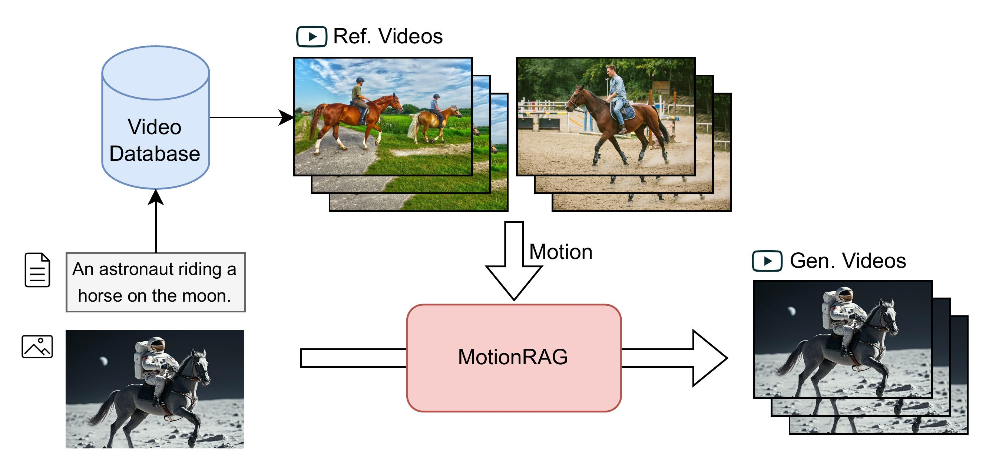
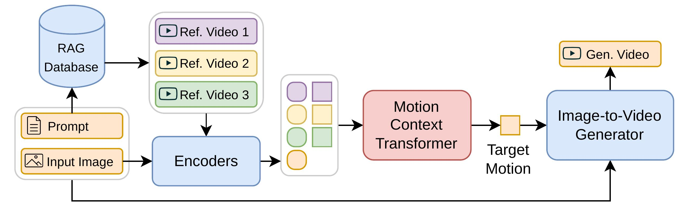
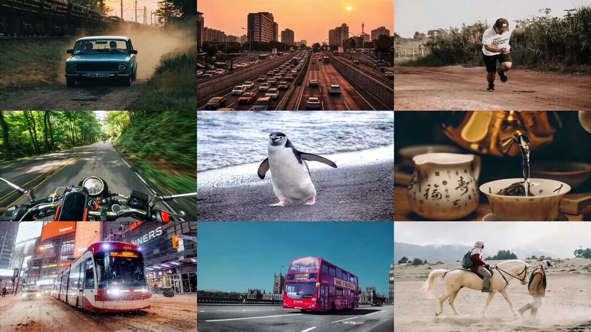
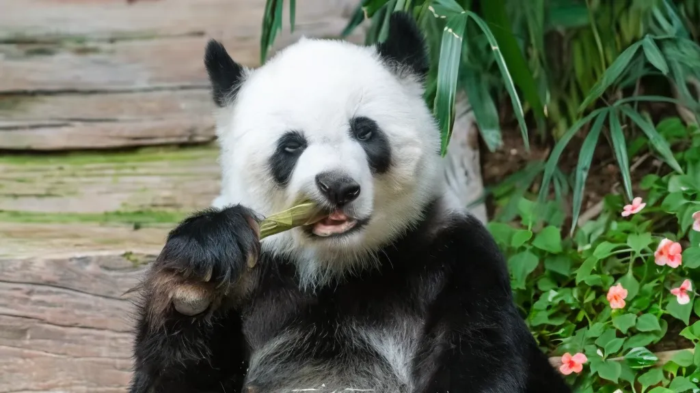
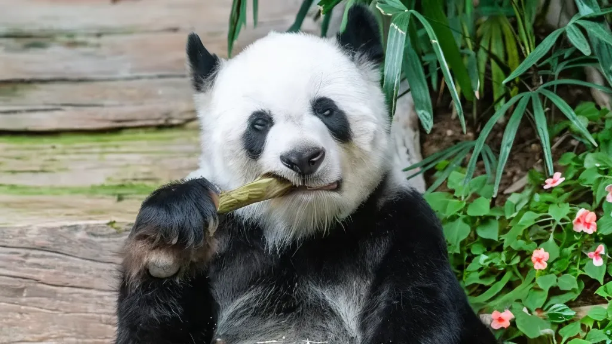

<div align="center">

# MotionRAG: Motion Retrieval-Augmented Image-to-Video Generation

<div align="center">
  <a href=https://huggingface.co/MCG-NJU/MotionRAG target="_blank"></a>
  <a href=https://github.com/MCG-NJU/MotionRAG target="_blank"></a>
  <a href=https://arxiv.org/pdf/2509.26391 target="_blank"></a>
</div>

</div>

## 🌟 Overview

MotionRAG is a novel retrieval-augmented framework for image-to-video generation that significantly enhances motion realism by transferring motion priors from relevant reference videos. Our approach addresses the fundamental challenge of generating physically plausible and semantically coherent motion in video generation.

<div align="center">
  
</div>

## 🔥 Key Features

- **Cross-Domain Motion Transfer**: Transfer motion patterns across visually different but semantically similar domains (e.g., person riding a horse → astronaut riding a horse)
- **Context-Aware Motion Adaptation (CAMA)**: Novel in-context learning approach for motion transfer using causal transformer architecture
- **Zero-Shot Generalization**: Extend to new domains by simply updating the retrieval database without retraining
- **Minimal Computational Overhead**: Adds less than 4 seconds to inference time while significantly improving motion quality
- **Multi-Model Support**: Compatible with state-of-the-art image-to-video models including CogVideoX, DynamiCrafter, and Stable Video Diffusion

## 🏗️ Architecture

MotionRAG employs a three-stage process:

1. **Text-based Retrieval**: Identify semantically relevant reference videos using text embeddings
2. **Context-Aware Motion Adaptation**: Adapt motion patterns through our novel CAMA module
3. **Motion-Guided Generation**: Inject adapted motion features into pretrained diffusion models

<div align="center">
      
</div>

## 📊 Results

MotionRAG achieves significant improvements across multiple models and datasets. Here's a comparison between baseline models and their MotionRAG-enhanced versions:

| Model               | Action Score ↑    | DINO ↑            | FVD ↓             | Inference Time      |
|---------------------|-------------------|-------------------|-------------------|---------------------|
| CogVideoX           | 59.9              | 87.8              | 87.1              | 59.4s               |
| CogVideoX + RAG     | **65.8 (+9.9%)**  | **89.4 (+1.8%)**  | **80.2 (-8.0%)**  | 63.0s (+3.6s)       |
| DynamiCrafter       | 53.5              | 85.8              | 88.4              | 87.6s               |
| DynamiCrafter + RAG | **62.1 (+16.1%)** | **88.4 (+3.0%)**  | **69.0 (-22.0%)** | 89.4s (+1.8s)       |

### MotionRAG Generation Visualization

To illustrate the effectiveness of MotionRAG, we showcase the generation results from CogVideoX enhanced with MotionRAG:

<div align="center">
  
</div>

The figure above visualizes the motion generation effects of our MotionRAG approach. Below we provide detailed comparisons for specific scenarios:

| Scenario                         | Without RAG                                                                                                    | With RAG                                                                                                           |
|----------------------------------|----------------------------------------------------------------------------------------------------------------|--------------------------------------------------------------------------------------------------------------------|
| Person riding a horse            |  |  |
| Man running on dirt road         |                                    |                                    |
| Tram traveling down snowy street |                 |                 |
| Panda eating bamboo              |                             |                             |
| Metal balls suspended in air     |                                 |                                 |


## 🚀 Getting Started

### 🐳 Installation with Docker

```bash
# Clone the repository
git clone https://github.com/MCG-NJU/MotionRAG.git
cd MotionRAG

# Build the Docker image
docker build -t MotionRAG .

# Run the container
docker run -it --gpus all -v ./:/workspace MotionRAG
```

### 📥 Download Models and Dataset

First, you'll need to download the pre-trained model checkpoints and dataset:

- **Model Checkpoints**: Download from [Hugging Face - MotionRAG](https://huggingface.co/MCG-NJU/MotionRAG)
  - See [docs/model.md](docs/model.md) for detailed information about the checkpoint files
- **Dataset**: Download and extract videos from [Hugging Face - OpenVid-1M](https://huggingface.co/nkp37/OpenVid-1M)

### 🗃️ Build RAG Database

Create the retrieval-augmented generation database:

```bash
python tools/build_rag_database.py
```

This script will process the dataset and build the vector database for motion retrieval.

### ▶️ Run Inference

Generate videos using the MotionRAG framework:

```bash
python main.py test -c configs/cogvideox/MotionRAG_open.yml
```

This command will run inference using the CogVideoX-based MotionRAG configuration.

### 🏋️ Training

MotionRAG employs a two-stage training approach for optimal performance:

#### **Stage 1**: Train Motion Adapter and Resampler modules

```bash
python main.py fit -c configs/cogvideox/action_injection.yml
```

#### **Stage 2**: Train Motion Context Transformer

First, preprocess the videos to accelerate training by resizing them to lower resolution:

```bash
python tools/resize_video.py -i path/to/original/videos -o path/to/resized/videos
```

Train the Motion Context Transformer with the second configuration:

```bash
python main.py fit -c configs/motion_transformer/condition_trans_dino_cog_open.yml
```


## 📁 Project Structure

```
MotionRAG/
├── src/
│   ├── projects/
│   │   ├── cogvideox/           # CogVideoX implementation
│   │   ├── dynamicrafter/       # DynamiCrafter implementation
│   │   ├── svd/                 # Stable Video Diffusion implementation
│   │   └── condition/           # Motion adaptation modules
│   │       ├── encoders/        # Condition encoders (CLIP, DINO, VideoMAE)
│   │       └── module.py        # Condition transformer modules
│   ├── data/                    # Data loading and processing
│   ├── metrics/                 # Evaluation metrics
│   └── utils/                   # Utility functions
├── configs/                     # Configuration files
├── tools/                       # Helper scripts
├── checkpoints/                 # Model checkpoints
│   ├── CogVideoX/               # CogVideoX checkpoints
│   ├── DynamiCrafter/           # DynamiCrafter checkpoints
│   └── SVD/                     # SVD checkpoints
└── datasets/                    # Datasets
    └── OpenVid-1M/              # OpenVid-1M dataset
```

## 📚 Citation

If you find MotionRAG useful for your research, please cite our paper:

```bibtex
@inproceedings{zhu2025motionrag,
  title={MotionRAG: Motion Retrieval-Augmented Image-to-Video Generation},
  author={Zhu, Chenhui and Wu, Yilu and Wang, Shuai and Wu, Gangshan and Wang, Limin},
  booktitle={Proceedings of the 39th International Conference on Neural Information Processing Systems},
  year={2025},
}
```

## 📄 License

This project is licensed under the MIT License - see the [LICENSE](LICENSE) file for details.

## 🙏 Acknowledgments

We thank the open-source community and the authors of CogVideoX, DynamiCrafter, and Stable Video Diffusion for their excellent work.
